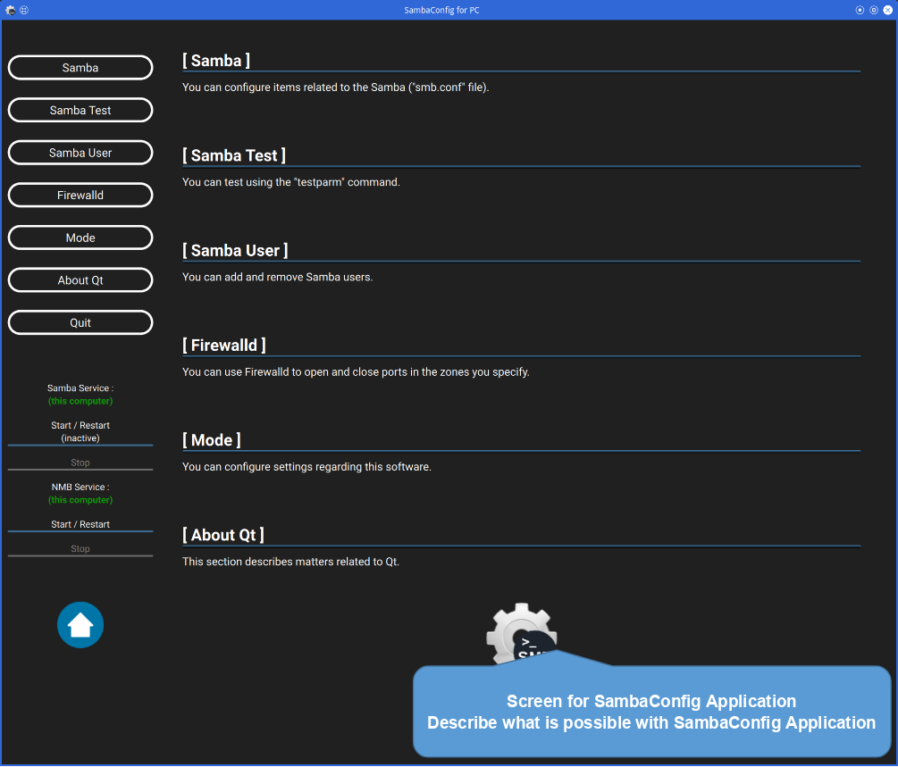
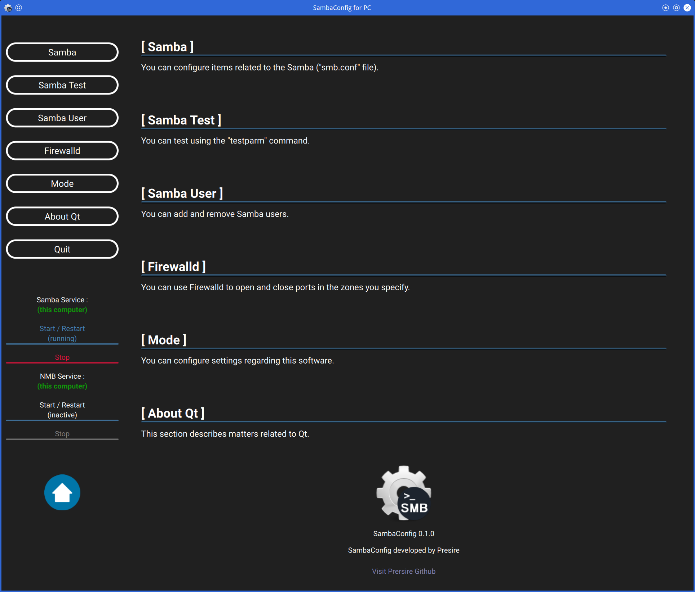

# SambaConfig for Linux PC (x86_64)

**<u>This software is still under development.</u>**  
 

# Preface  
SambaConfig is software that allows you to configure smb.conf files on GUI.  
This software is an alternative to System-Config-Samba.  
 

**This software is developed with Qt 6.5.**  
**Therefore, Qt 6.5 or later is required.**  
 

This article uses SUSE Linux Enterprise (x86_64).  
<u>you should be able to install it on other Linux distributions as well.</u>  
(Ex. Fedora, Debian, ... etc)  
 
 

# 1. Install the necessary dependencies for SambaConfig

* Qt6 Core
* Qt6 Gui
* Qt6 D-Bus
* Qt6 Concurrent
* Qt6 Quick
* Qt6 QuickControls2
* Qt6 Qml
* Qt6 QmlModels
* Qt6 Linguist (Translation)
  * <https://www.qt.io/>  
  * This software uses Qt, and Qt used is under LGPL license.  
  * You will find its license file in following directory.  
    <I>**ThirdPartyLicenses/Qt.txt**</I>  
 

* Polkit-Qt1  (Use SambaConfigHelper)
  * <https://api.kde.org/polkit-qt-1/html/>  
  * This software uses Polkit-Qt1, and Polkit-Qt1 used is under LGPL license.  
  * You will find its license file in following directory.  
    <I>**ThirdPartyLicenses/Polkit-Qt1.txt.txt**</I>  
 

* Polkit  (Use SambaConfigHelper)
  * <https://www.freedesktop.org/software/polkit/docs/latest/>  
  * Polkit-Qt1 uses Polkit, and Polkit used is under LGPL license.  
  * You will find its license file in following directory.  
    <I>**ThirdPartyLicenses/Polkit.txt**</I>  
 
 

# Execute SambaConfig  
## 5.1 **For PC**
### Main screen  
|SambaConfig Main (Server Mode)|
|---|
||
 

Select the item you wish to set from buttons on the left side of main screen.  
You can start (restart) and stop Samba by clicking on the labels under the buttons.  

To start (restart) and stop Samba on remote server, you must enter the remote connection settings.  
 

You can return to Home Screen by pressing [Home] button or [Shift] + [Esc] buttons.  
 

If your mouse has [Forward] or [Back] button, you can go back and forward through each menu screen.  
 

### Samba / NMB service start / stop from this software  
|SambaConfig Side Panel (Server Mode)|SambaConfig Side Panel (Server Mode)|
|---|---|
|||
 

Samba / NMB can be started and stopped from this software.  

* [Start / Restart]  
  Start or restart Samba / NMB.  s
* [Stop]
  Stop Samba / NMB.  
 

### Edit Samba configuration  
Click the [Samba] button to configure various Samba settings.  
 

|Before load smb.conf (Server Mode)|Select smb.conf (Server Mode)|
|---|---|
|||
 

After smb.conf has finished loading,  
each section and its summary will be displayed in a list.  

|Section Display (Server Mode)|
|---|
||
 

Double-click each section displayed in the list  
to open the configuration screen for that section.  
 

**[global]** section is a special section, there are two items that can be set.  
* Change share name  
* Set user and group access privileges  
 

**[users] section**  
There are six items that can be set.  
* Directory path  
* Change share name  
* Read/write permissions  
* Visibility  
* Share name description  
* Set user and group access privileges  
 

|Section Basic Settings ([global]) |Section Basic Settings ([users]) |
|---|---|
|||
 

In the user and group access permission settings  
* Allow all users and groups  
* Add users and groups manually  
 

|Access Settings (all users and groups)|
|---|
||
 

If you want to add users and groups manually,  
first, specify the path to the "pdbedit" command,  
and click the "Get Users and Groups" button.  

Next, specify any user or group name from the pull-down menu.  

Group names are prefixed with "@".  
 

|Access Settings (users and groups manually)|
|---|
||
 

### Test smb.conf
|Testing smb.conf(1) (Server Mode)|
|---|
||
 

The <code>testparm</code> command can be used to check that the smb.conf file is written correctly.  
You can also specify the options for the <code>testparm</code> command and the path to the <code>testparm</code> command.  
 

Of course, you can also check the smb.conf file on the remote server.  
Then, please disable "Server Mode".  
 

### Add / Delete Samba users  
**Currently implemented.**  
 

### Firewalld Settings  
|Firewalld Setting (Server Mode)|
|---|
||
 

|Firewalld Zone (Server Mode)|Firewalld port (Server Mode)|
|---|---|
|||
 

First, press the [Load Zones] button to load the zones that exist.  
Then, the name of the zone that exists in the system will appear in the pull-down.  

Select a zone name from the pull-down menu.  

Next, press the [+] button to specify the port number and protocol (TCP or UDP) to open / close.  

Finally, select [Open Port] or [Close Port].  
 

### Settings SambaConfig application  
|SambaConfig Settings (Server Mode)|
|---|
||
 

* Server Mode (Currently Server Mode only)  
  When "Server Mode" is enabled, locally installed Samba can be configured.  
  When "Server Mode" is disabled, you can configure Samba installed on remote server.  
 

* Need Administrator Password  
  When "Server Mode" is enabled, the smb.conf file can be edited without administrative privileges,  
  even if the file requires administrative privileges.  
 

* Font Size  
  Change font size. (plus or minus 3 points)  
 

* Dark Theme  
  Change to Dark Theme.  
  To reflect the settings, the application must be restarted.  
 

* Language  
  Change the language of application.  
  Currently, only English and Japanese can be changed.  
  To reflect the settings, the application must be restarted.  

 
